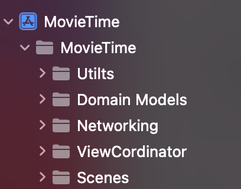
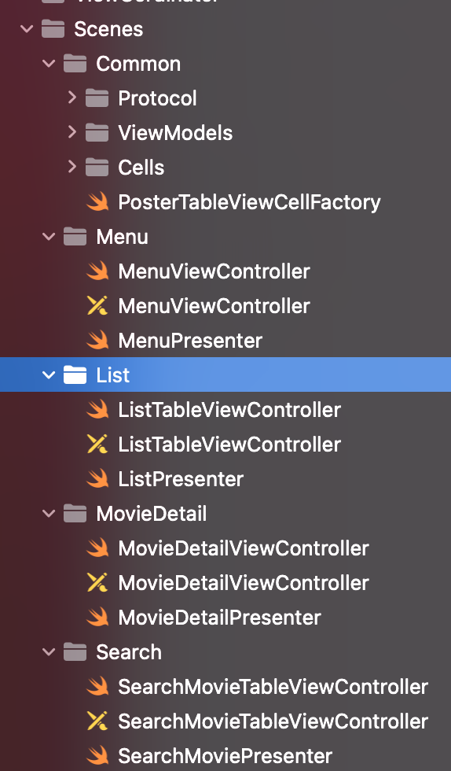
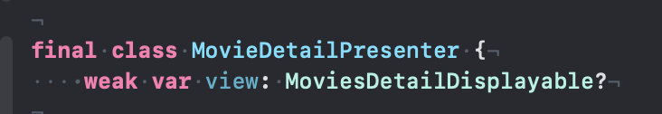

# MovieTime
A basic iOS application to visualize movies

#### Arquitecrure of this project

This project is using MVP as arquitectural Patter. In Order to avoid massive view controllers there are several classes locaded in 5 folder

- **Utils**: This folder containts extension of system classes like `UIAlertController`. In this folder is also the class related to a loader/spinner which will be designed to work on a `UIViewController`
- **Domain Models:** This folder was created to have all classes from domain in this case the responses models from `themoviedb` API
- **Networking:** All classes, structs, protocols and extensions related to netwrokig are located here. Even the reachability and image chache behaviours are located here.
- **ViewCordinator:** This folder contains only one class which was created to manage the navigation. This is a basic app so far so it's not complex.
- **Scene:** ViewController, Presenters and Cells are located in this folder

##### ViewController Organization

Every `viewController` has its own presenter all the logic, business rules and networking cases are managed by the presenter. Into presenters initializations I'm injecting the dependencies in order to make the unit test easier to be created. 
The comunication between presenter and viewControllers is  through protocols and only the needed methods are exposed. In order to avoid retain cycle the viewController reference is `weak`  
 

#### FAQ
### What is the single-responsibility principle?
This principle is one of the SOLID principle which says that every class into any code should only be responsiple of one functionality. For example, into this project there is a class named as `PosterTableViewCellFactory` and this only have the resposibility of create cells, this class doesn't create model or parsing data beacause that is not its purpose.
### What is the purpose of SOLID?
The five principles intended to make software designs more understable, flexible and maintainable. It's essencial to follow those principles in any mobile application for future changes, migrations or improvements.

### What is clean code
In my experience a clean code is every code which can be easy to read to any developer. With this in mind the code will be easy to modify. Each developer has ther own writing style, and the level of reding depende on our experience. We all want to write a simple, beautiful and concise code.

### Ways to improve this code
One thing to improve the code is to use `Task` and `await` to use concurrency and remove the closures

